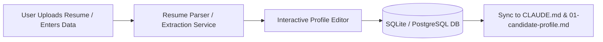
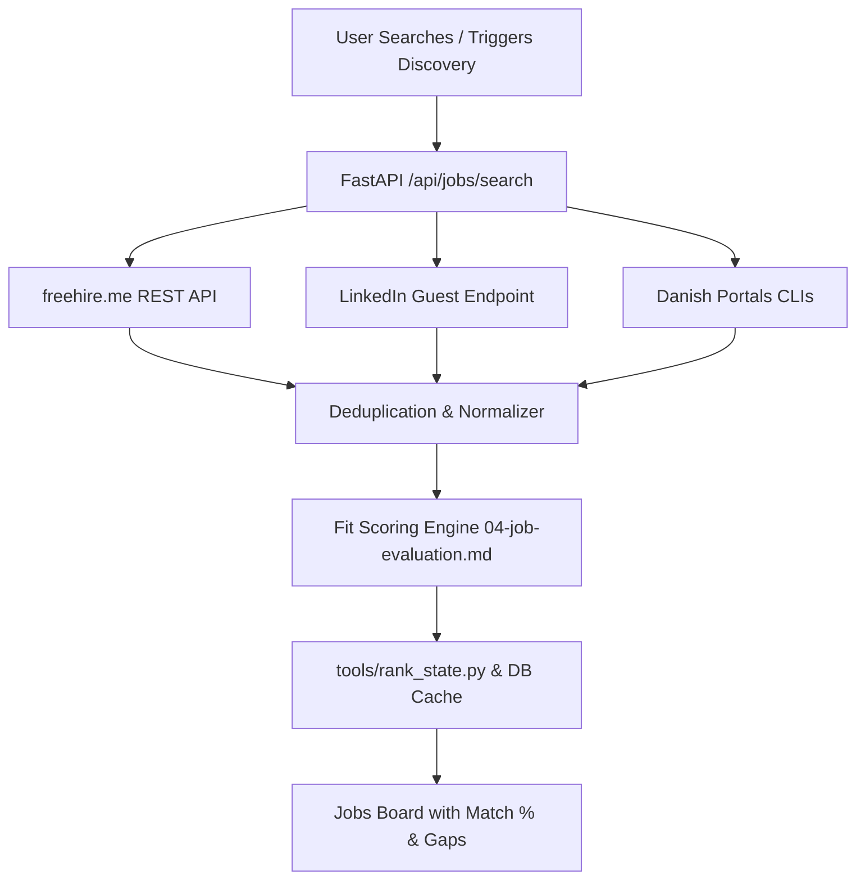
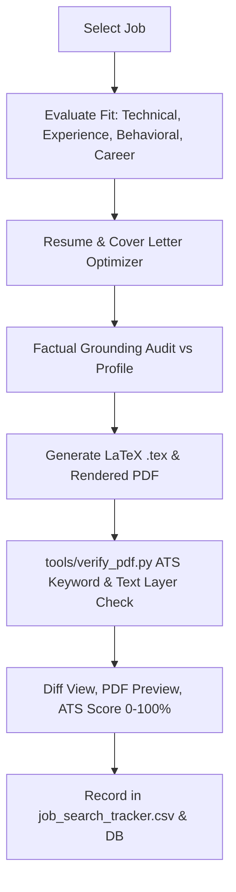
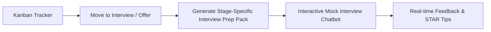

# Architecture Analysis & System Audit: AI Job Search

## 1. Executive Summary & Existing Architecture

The **AI Job Search** repository (`mohannamburu18/ai-job-search`, forked from `MadsLorentzen/ai-job-search`) is a sophisticated, agentic job search and application preparation framework. Originally designed as a CLI-driven workflow orchestrated by Claude Code markdown slash commands and shell scripts, it implements:
- Multi-market job searching across 6 portal skills (`freehire-search`, `linkedin-search`, `jobindex-search`, `jobbank-search`, `jobdanmark-search`, `jobnet-search`).
- Structured fit evaluation based on 5 weighted scoring dimensions and 2 hard gates (Eligibility Gate, Language Gate).
- Batch triage and ranking state management (`tools/rank_state.py`, `job_scraper/seen_jobs.json`).
- Tailored LaTeX CV and cover letter drafting with moderncv banking and `cover.cls` templates.
- Drafter-Reviewer multi-agent critique loop with strict anti-hallucination / factual grounding audits.
- Text-layer ATS parseability and keyword coverage verification (`tools/verify_pdf.py` using `pypdf`).
- Application tracking pipeline (`job_search_tracker.csv`).
- Comprehensive company research caching (`company_research/`) and salary benchmarking (`salary_lookup.py`).
- Interview preparation with stage-specific question generation, STAR mapping, and mock interviews.
- 383 unit/integration tests (377 passing, 6 skipped).

The repository currently lacks a web-based user interface, an HTTP REST API server, database persistence, and user session management. The goal of this transformation is to wrap these battle-tested AI workflows, state machines, and scrapers in a **FastAPI backend** and build a **cutting-edge Next.js 15+ 3D web application** featuring subtle Three.js / React Three Fiber depth, glassmorphism, animated metrics, and end-to-end usable workflows.

---

## 2. Discovered Functionality & Subsystems

| Subsystem | Existing Implementation | Nature | Production Quality Status |
| :--- | :--- | :--- | :--- |
| **Profile & Onboarding** | `CLAUDE.md`, `.claude/skills/job-application-assistant/01-candidate-profile.md`, `.claude/commands/setup.md` | Markdown schemas with placeholders | Fully structured; needs parser & API endpoints |
| **Job Scrapers** | `.agents/skills/` (freehire, linkedin, jobindex, jobnet, jobdanmark, jobbank) | TypeScript / Bun CLIs, REST API (freehire.me), LinkedIn jobs-guest HTML | Working live; `freehire-search` and `linkedin-search` tested and operational |
| **Job Ranking & Triage** | `tools/rank_state.py`, `job_scraper/seen_jobs.json` | Python CLI with atomic tempfile replacement | 100% verified by 25+ pytest unit tests |
| **Fit Scoring Engine** | `.claude/skills/job-application-assistant/04-job-evaluation.md` | Weighted formula (Tech 30%, Exp 25%, Beh 15%, Career 30%) + Gates | Deterministic & LLM-grounded rubric |
| **Resume & Cover Letter Drafting** | `cv/main_example.tex`, `cover_letters/cover_example.tex`, `.claude/commands/apply.md` | LaTeX (moderncv banking, cover.cls, Raleway/Lato fonts) | Complete LaTeX templates; needs PDF renderer + text download |
| **ATS Verification** | `tools/verify_pdf.py` | Python CLI with `pypdf` text extraction | Operational; extracts text layer and validates keywords |
| **Salary Benchmarking** | `salary_lookup.py` | Python fuzzy matching on company salary dataset | Operational; handles Danish/anglicized name variants |
| **Application Tracking** | `job_search_tracker.csv` | Standardized CSV with 14 columns and fixed vocab | Operational; needs database sync + REST API |
| **Interview Preparation** | `.claude/commands/interview.md`, `07-interview-prep.md` | Stage-specific prep pack, STAR question mapping | Structured prompt guidelines; needs interactive UI |
| **Company Research** | `company_research/<company>.json` | JSON cache schema with TTL | Cached storage format ready |

---

## 3. Dependencies & Runtime Environment

- **Runtimes Detected**:
  - Node.js: `v24.16.0` (LTS/Modern)
  - Python: `3.14.5` (Modern, with `pytest`, `pypdf`, `anyio` installed)
  - Bun: Not installed globally; however, Node.js + `tsx` or native Node ESM runs TypeScript CLIs directly, and freehire.me is standard HTTPS REST.
  - LaTeX: `xelatex`/`lualatex` not natively in Windows PATH; system must provide both LaTeX source download AND an integrated web-standard PDF generation fallback (HTML/Canvas/PDF) for instant in-browser viewing and downloading.
- **Python Dependencies Needed for Backend**:
  - `fastapi`, `uvicorn`, `pydantic`, `sqlalchemy`, `aiosqlite`, `python-jose` (or `pyjwt`), `passlib[bcrypt]`, `python-multipart`, `httpx`, `pypdf`, `reportlab` (or `weasyprint`).
- **Frontend Dependencies Needed**:
  - `next`, `react`, `react-dom`, `typescript`, `tailwindcss`, `framer-motion`, `@react-three/fiber`, `@react-three/drei`, `three`, `lucide-react`, `canvas-confetti`, `clsx`, `tailwind-merge`.

---

## 4. End-to-End Data & AI Workflow Flows

### Flow 1: Profile Onboarding (`/setup` -> Web Profile)

### Flow 2: Job Discovery & Ranking (`/scrape` & `/rank` -> Jobs UI)

### Flow 3: Tailoring & Application Preparation (`/apply` -> Studio UI)

### Flow 4: Application Tracking & Interview Prep (`/interview` & `/outcome`)

---

## 5. Architectural Decisions & Technology Stack

### A. Backend Architecture: FastAPI + SQLAlchemy + Native Tools
- **Why FastAPI?** The entire existing toolchain (`verify_pdf.py`, `rank_state.py`, `salary_lookup.py`, tests) is written in Python. Wrapping these directly avoids unnecessary IPC overhead, preserves 100% of the existing logic, and provides high-speed asynchronous endpoints with automatic OpenAPI documentation.
- **Database**: SQLite (via SQLAlchemy async) for zero-configuration, self-contained single-user or multi-user persistence, with automatic bidirectional synchronization to `job_search_tracker.csv` and `job_scraper/seen_jobs.json`.
- **Security**: JWT authentication with bcrypt password hashing, secure HTTP-only cookies or bearer tokens, sanitized file upload handlers, and zero secrets committed to Git.

### B. Frontend Architecture: Next.js 15 App Router + Tailwind CSS + 3D
- **Why Next.js App Router?** Server-side rendering for speed, client-side interactive React components, and easy proxying to the FastAPI backend (`/api/*`).
- **3D & Visual Aesthetics**:
  - Three.js / React Three Fiber canvas for a subtle, high-performance hero visualization representing the flow: `Resume -> AI Neural Analysis -> Curated Job Spheres -> Tailored Output`.
  - Sophisticated dark-mode palette: Deep slate/obsidian backgrounds (`#0B0F17`, `#111827`), glowing cyan/indigo accents (`#06B6D4`, `#6366F1`), layered glassmorphic cards with frosted borders and backdrop blur.
  - Smooth Framer Motion page transitions, animated metric counters, and interactive diff visualizers.
  - Performance safeguard: 3D canvas automatically downgrades or simplifies on mobile devices / low-power hardware.

---

## 6. Required Adapters & Service Boundaries

1. **Job Search Service Adapter (`backend/services/job_search.py`)**:
   - Executes freehire.me JSON API and LinkedIn search endpoints natively or via TS CLIs.
   - Normalizes disparate fields into a unified `JobListing` schema: `id`, `title`, `company`, `location`, `work_mode`, `date`, `url`, `skills`, `description`, `source`.
2. **AI Fit Evaluation Adapter (`backend/services/evaluation.py`)**:
   - Implements the exact weighting: Technical (30%), Experience (25%), Behavioral (15%), Career (30%), plus Location & Language Gate logic.
   - Calculates grounded strengths, missing requirements, and match percentages.
3. **Resume & Cover Letter Generation Adapter (`backend/services/generator.py`)**:
   - Compiles tailored LaTeX documents using `main_example.tex` and `cover.cls`.
   - Runs factual grounding checks against candidate profile to guarantee no invented facts.
   - Generates browser-viewable PDF documents and verifies text extraction via `tools/verify_pdf.py`.
4. **Application Automation Boundary (`backend/services/automation.py`)**:
   - Concrete service interface establishing `detect_fields()`, `map_profile()`, `fill_fields()`, and `require_user_confirmation()`.
   - Strictly requires explicit user confirmation before any final action.

---

## 7. Security & Privacy Considerations

1. **Data Leakage Prevention**: All candidate profile data, resumes, and cover letters are stored locally in the application database and personal folders.
2. **Prompt Injection Mitigation**: Job posting descriptions are untrusted input. The backend strips dangerous injection delimiters and instructs the evaluation engine to treat job postings exclusively as content to analyze, never instructions to execute.
3. **File Upload Security**: Strict MIME type validation (PDF, DOCX, TXT), 10MB file size limit, and path traversal sanitization on all uploaded documents.
4. **Environment Isolation**: All API keys (OpenAI, Anthropic, Gemini, etc.) and JWT secrets are managed via `.env` and never leaked to the client browser.

---

## 8. Implementation Roadmap

1. **Phase 1: Backend Foundation (FastAPI)**: Setup app, database models, auth, file handlers, and existing tool wrappers.
2. **Phase 2: Core Business Logic Services**: Job search aggregator, fit scoring engine, LaTeX/PDF generation, ATS text verification.
3. **Phase 3: Frontend Foundation (Next.js)**: Setup App Router, Tailwind design system, UI components, layout, and auth state.
4. **Phase 4: 3D Hero & Premium Landing Page**: Subtle R3F particle/node visualization, marketing sections, feature highlights.
5. **Phase 5: Onboarding & Profile Studio**: Resume upload, automated parser, interactive candidate profile editor.
6. **Phase 6: Jobs Discovery & Details**: Live search, filters, match scoring badges, in-depth job breakdown.
7. **Phase 7: Resume vs Job Comparison & Optimization Studio**: Side-by-side comparison, grounded optimization, diff highlighter.
8. **Phase 8: Cover Letter Generator & ATS Checker**: Tone selector, live preview, keyword coverage checklist.
9. **Phase 9: Application Tracker & Pipeline**: Interactive Kanban board with status updates and note taking.
10. **Phase 10: Interview Prep & Mock Interview**: Stage-specific question cards, STAR talk tracks, live conversational mock interview.
11. **Phase 11: End-to-End Verification & Tests**: API tests, frontend build, responsive polish, and documentation.

